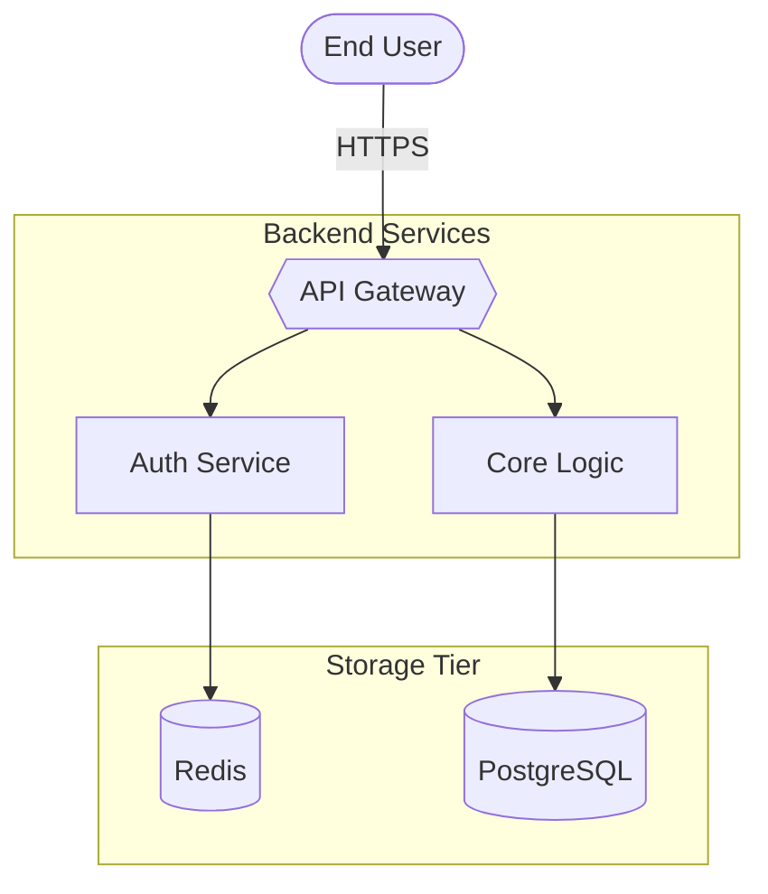
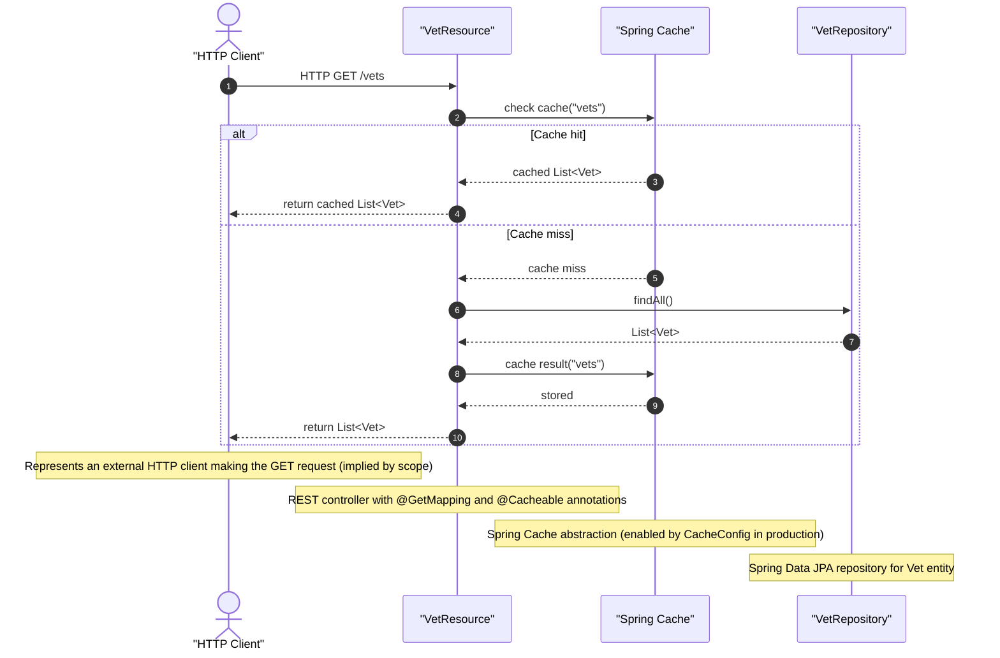

# petclinic-vets-service

Backend microservice for managing veterinary resources in the Spring PetClinic ecosystem.

The `petclinic-vets-service` is a Spring Boot microservice that provides a REST API for listing and retrieving veterinarian data. It uses Spring Data JPA for persistence, supports service discovery via Netflix Eureka, and includes caching for optimized repeated queries. The service exposes two primary endpoints under the `/vets` path, backed by a repository-driven data access layer.

## Architecture

The service follows a standard Spring Boot layered architecture with clear separation between web, system/configuration, and model/persistence layers.

### Component Overview

| Component | Responsibility |
|---|---|
| **VetResource** | REST controller handling HTTP requests under `/vets`. Delegates to `VetRepository` for data retrieval. |
| **VetRepository** | Spring Data JPA interface providing `findAll()` and `findById()` operations on the `Vet` entity. |
| **Vet** | JPA entity representing a veterinarian, including first/last name and a set of specialties. |
| **Specialty** | JPA entity representing a veterinarian's area of specialization (e.g., dentistry, radiology). |
| **VetsProperties** | Typesafe configuration properties bound to the `vets` prefix, managing cache settings (TTL, heap size). |
| **CacheConfig** | Spring `@Configuration` class that enables caching, active only under the `production` profile. |
| **VetsServiceApplication** | Application entry point. Enables discovery client and configuration properties binding. |

### Data Flow

1. An HTTP GET request arrives at `VetResource`.
2. The controller calls `VetRepository` (a Spring Data JPA interface) to query the backing database.
3. The repository returns `Vet` entities (optionally with their associated `Specialty`集合).
4. The response is serialized to JSON and returned to the caller.

### System Architecture



### Vet Listing Flow



### Key Design Decisions

- **Service Discovery**: The application enables `@EnableDiscoveryClient`, registering itself with Netflix Eureka for dynamic service lookup in a microservice topology.
- **Profile-based Caching**: The `@EnableCaching` annotation is only activated under the `production` profile via `CacheConfig`, preventing unnecessary cache overhead during development.
- **Configuration Properties**: `VetsProperties` is a Java `record` bound to the `vets` prefix, providing structured access to cache tuning parameters (`ttl`, `heapSize`).
- **Separation of Concerns**: The model layer (`Vet`, `Specialty`, `VetRepository`) is fully decoupled from the web layer (`VetResource`), allowing independent evolution.

## Project Structure

```
petclinic-vets-service/
├── pom.xml                                          # Maven build config, dependencies, profiles
└── src/
    ├── main/
    │   └── java/org/springframework/samples/petclinic/vets/
    │       ├── VetsServiceApplication.java          # Spring Boot entry point
    │       ├── model/
    │       │   ├── Vet.java                         # JPA entity for a veterinarian
    │       │   ├── Specialty.java                   # JPA entity for a vet's specialty
    │       │   └── VetRepository.java               # Spring Data JPA repository interface
    │       ├── system/
    │       │   ├── CacheConfig.java                 # Caching config (production profile only)
    │       │   └── VetsProperties.java              # Typesafe configuration properties
    │       └── web/
    │           └── VetResource.java                 # REST controller for /vets endpoints
    └── test/
        └── java/org/springframework/samples/petclinic/vets/
            └── web/
                └── VetResourceTest.java             # Unit tests for VetResource
```

### Package Responsibilities

| Package | Contents |
|---|---|
| `model` | JPA entities (`Vet`, `Specialty`) and the `VetRepository` data access interface. |
| `system` | Cross-cutting configuration: caching setup (`CacheConfig`) and typesafe properties (`VetsProperties`). |
| `web` | REST layer: the `VetResource` controller and its unit tests. |